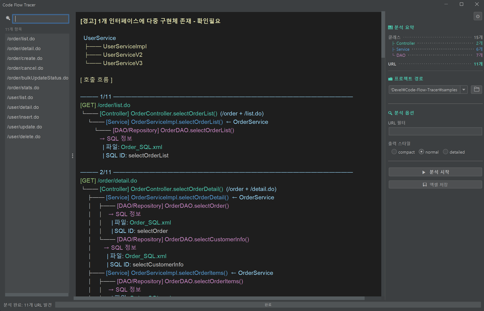
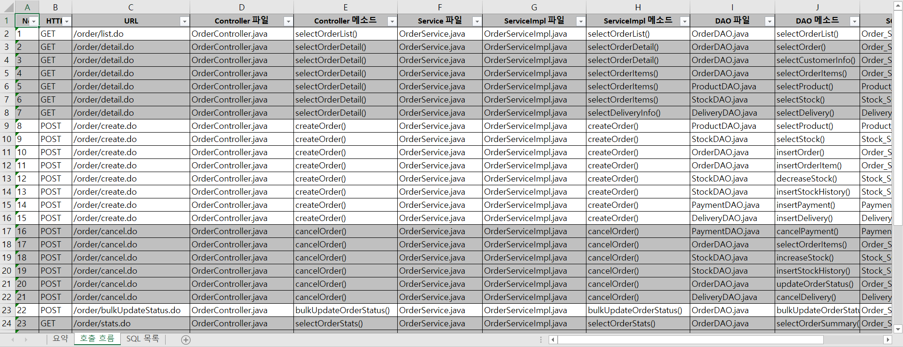

# Code Flow Tracer

> 레거시 Java 코드의 호출 흐름을 자동으로 분석하고 문서화하는 도구

[](https://openjdk.org/)
[](https://gradle.org/)
[](LICENSE)

---

## 왜 만들었나요?

SI 프로젝트에서 **레거시 코드를 파악하는 것은 매우 시간이 많이 걸리는 작업**입니다.

- API 하나의 흐름을 따라가려면 여러 파일을 오가며 수동으로 추적해야 합니다
- 분기가 많은 코드에서는 흐름이 헷갈립니다
- 인수인계 시 문서화된 자료가 부족합니다

**Code Flow Tracer**는 이 과정을 자동화합니다:

```
[요청 URL: /api/user/list]
    ↓
[UserController.getList()]
    ↓
[UserService.findAll()]
    ↓
[UserDAO.selectUserList]
    ↓
[SQL: SELECT * FROM TB_USER WHERE USE_YN = 'Y']
```

---

## 실행 결과

### 콘솔 출력 (ANSI 색상 지원)


> Controller → Service → DAO → SQL까지 호출 흐름을 트리 형태로 시각화합니다.
> 각 계층(Controller, Service, DAO)은 색상으로 구분되어 한눈에 파악할 수 있습니다.

<details>
<summary>출력 스타일 옵션 보기</summary>

| 스타일 | 설명 | 예시 |
|--------|------|------|
| `normal` | 기본 트리 구조 | `└── [Controller] UserController.selectUserList()` |
| `compact` | 간결한 표시 | `UserController → UserService → UserDAO` |
| `detailed` | URL, HTTP 메서드 포함 | `[GET] /user/list.do → UserController...` |

```bash
# 스타일 지정
java -jar code-flow-tracer.jar -p /path/to/project -s detailed
```

</details>

### GUI 모드



> FlatLaf Darcula 다크 테마를 적용한 Desktop GUI입니다.
> CLI 없이 마우스로 프로젝트를 분석하고 결과를 확인할 수 있습니다.

<details>
<summary>GUI 주요 기능 보기</summary>

| 기능 | 설명 |
|------|------|
| **프로젝트 선택** | 폴더 브라우저로 분석할 프로젝트 선택 |
| **세션 복원** | 앱 재시작 시 마지막 분석 결과 자동 복원 |
| **최근 경로 기억** | 최근 사용한 프로젝트 경로 10개 저장 |
| **URL 필터** | 특정 URL 패턴만 분석 (예: `/api/user/*`) |
| **CRUD 실시간 필터** | SELECT/INSERT/UPDATE/DELETE 체크박스로 즉시 필터링 |
| **출력 스타일** | Compact, Normal, Detailed 선택 |
| **결과 보기** | 콘솔 스타일 트리 출력, 텍스트 드래그 선택 가능 |
| **테이블 영향도 분석** | 테이블별 CRUD 통계, 접근 URL 역추적, 실시간 검색 필터 |
| **엑셀 저장** | 분석 결과를 엑셀 파일로 저장 (테이블 영향도 시트 포함) |
| **폰트 크기 조절** | Ctrl + 마우스 휠로 9px~24px 조절 |
| **마우스 뒤로가기** | 마우스 뒤로가기 버튼으로 이전 화면 복귀 지원 |
| **패널 리사이즈** | 좌측 설정 패널 드래그로 크기 조절 |
| **분석 취소** | 분석 중 버튼 클릭으로 취소 가능 (토글 방식) |
| **분석 타임아웃** | 5분 초과 시 자동 중단, 에러 다이얼로그 표시 |
| **로그 관리** | 로그 폴더 열기, 로그 크기 설정(1/5/10MB), 로그 삭제 |

</details>

### 엑셀 출력



> 분석 결과를 엑셀 파일로 내보내 문서화하거나 인수인계 자료로 활용할 수 있습니다.
> **호출 흐름**, **SQL 목록**, **테이블 영향도** 시트로 구성됩니다.

<details>
<summary>엑셀 시트 구성 보기</summary>

| 시트 | 내용 |
|------|------|
| **요약** | 분석 일시, 프로젝트 경로, 클래스/URL 수 통계 |
| **호출 흐름** | URL별 Controller → Service → DAO → SQL 흐름, CRUD 타입 |
| **SQL 목록** | SQL ID, 테이블, 파라미터, 쿼리 원문 |
| **테이블 영향도** | 테이블별 접근 횟수, CRUD 통계, 접근 URL 목록 |

</details>

---

## 주요 기능

| 기능 | 설명 | 상태 |
|------|------|------|
| **호출 흐름 추적** | Controller → Service → DAO → SQL | ✅ 완료 |
| **iBatis/MyBatis 파싱** | XML SQL 매퍼에서 쿼리 추출 | ✅ 완료 |
| **콘솔 출력** | 트리 형태 + ANSI 색상 지원 | ✅ 완료 |
| **엑셀 출력** | 호출 흐름 + SQL 목록 + 테이블 영향도 시트 | ✅ 완료 |
| **Desktop GUI** | Swing 기반, FlatLaf 다크 테마 | ✅ 완료 |
| **세션 영속성** | 앱 재시작 시 마지막 분석 결과 복원 | ✅ 완료 |
| **CRUD 타입 필터링** | SELECT/INSERT/UPDATE/DELETE 실시간 필터 | ✅ 완료 |
| **테이블 중심 분석** | 테이블별 접근 URL/CRUD 역추적 | ✅ 완료 |
| **에러 핸들링** | 타임아웃(5분), 취소 버튼, 에러 로그 파일 | ✅ 완료 |
| **Windows 설치 파일** | JRE 번들 포함, Java 설치 불필요 | ✅ 완료 |
| **전자정부프레임워크** | 레거시 SI 환경 특화 지원 | ✅ 지원 |

---

## 빠른 시작

### 방법 1: 설치 파일 (권장)

Windows 사용자는 설치 파일을 다운로드하여 실행하면 됩니다. **Java 설치가 필요 없습니다.**

```
CFT-1.0.0.exe  (약 77MB, JRE 17 번들 포함)
```

설치 후 바탕화면 또는 시작 메뉴에서 **CFT** 실행

### 방법 2: JAR 직접 실행

#### 요구사항
- Java 17 이상

#### 빌드
```bash
./gradlew shadowJar
```

#### CLI 모드
```bash
# 전체 프로젝트 분석 (콘솔 출력)
java -jar build/libs/code-flow-tracer.jar -p /path/to/project

# 특정 URL만 분석
java -jar build/libs/code-flow-tracer.jar -p /path/to/project -u "/api/user/*"

# 출력 스타일 지정
java -jar build/libs/code-flow-tracer.jar -p /path/to/project -s detailed

# 엑셀로 출력
java -jar build/libs/code-flow-tracer.jar -p /path/to/project --excel -o result.xlsx

# SELECT 쿼리만 필터링
java -jar build/libs/code-flow-tracer.jar -p /path/to/project --sql-type SELECT

# 테이블 목록 및 영향도 분석
java -jar build/libs/code-flow-tracer.jar -p /path/to/project --list-tables

# 특정 테이블 접근 흐름만 분석
java -jar build/libs/code-flow-tracer.jar -p /path/to/project --table TB_USER
```

<details>
<summary>CLI 옵션 전체 보기</summary>

| 옵션 | 설명 |
|------|------|
| `-p, --path` | 분석할 프로젝트 경로 (필수) |
| `-u, --url` | URL 패턴 필터 (예: `/api/user/*`) |
| `-s, --style` | 출력 스타일: `compact`, `normal`, `detailed` (기본: normal) |
| `-o, --output` | 결과 파일 저장 경로 (예: result.xlsx) |
| `-d, --output-dir` | 엑셀 저장 디렉토리 (기본: output) |
| `--excel` | 엑셀 파일로 출력 |
| `--no-color` | 색상 출력 비활성화 |
| `--sql-type` | SQL 타입 필터 (예: `SELECT,INSERT`) |
| `--table` | 특정 테이블 접근 흐름만 표시 |
| `--list-tables` | 테이블 목록 및 영향도 분석 출력 |

</details>

#### GUI 모드
```bash
# GUI 실행 (콘솔 창 없이, 권장)
javaw -jar build/libs/code-flow-tracer.jar --gui

# 또는 scripts/run.bat 더블클릭
```

---

## 기술 스택

| 구분 | 기술 | 용도 |
|------|------|------|
| Language | Java 17+ | 모던 Java 문법 활용 |
| Build | Gradle 8.5 | 의존성 관리, Shadow JAR |
| 파싱 | JavaParser | Java 소스 AST 분석 |
| XML | JDOM2 | iBatis/MyBatis XML 파싱 |
| Excel | Apache POI | 엑셀 출력 |
| JSON | Gson | 세션 영속성 (JSON 직렬화) |
| CLI | Picocli | 명령줄 인터페이스 |
| GUI | Swing + FlatLaf | Desktop GUI (다크 테마) |

### 왜 이 기술들을 선택했나요?

자세한 내용은 [DESIGN.md](docs/DESIGN.md) 참고

---

## 프로젝트 구조

```
code-flow-tracer/
├── CLAUDE.md                 # 프로젝트 규칙 (AI 어시스턴트용)
├── README.md                 # 이 문서
├── VERSION.md                # 버전 히스토리
├── build.gradle
├── installer-resources/      # jpackage 커스텀 리소스
├── docs/                     # 문서
│   ├── PROJECT_PLAN.md      # 프로젝트 기획 (러너스하이)
│   ├── DESIGN.md            # 전체 설계
│   ├── USAGE.md             # 사용법
│   ├── TODO.md              # 할 일 목록
│   ├── DEV_LOG.md           # 개발 일지
│   └── ISSUES.md            # 문제 해결 기록
├── scripts/                  # 실행 스크립트
│   ├── run.bat              # GUI 모드 실행
│   └── analyze.bat          # CLI 모드 실행
├── src/
│   ├── main/java/com/codeflow/
│   │   ├── Main.java        # CLI 엔트리포인트
│   │   ├── parser/          # 소스 코드 파싱 ✅
│   │   ├── analyzer/        # 흐름 분석 ✅
│   │   ├── output/          # 출력 (콘솔 ✅, 엑셀 ✅)
│   │   ├── session/         # 세션 영속성 ✅
│   │   └── ui/              # Swing GUI ✅
│   └── test/java/
└── samples/                  # 테스트용 샘플 코드
```

---

## 문서

| 문서 | 설명 |
|------|------|
| [PROJECT_PLAN.md](docs/PROJECT_PLAN.md) | 프로젝트 기획, 러너스하이 계획 |
| [DESIGN.md](docs/DESIGN.md) | 전체 설계, 기술 선택 근거 |
| [USAGE.md](docs/USAGE.md) | 상세 사용법 |
| [TODO.md](docs/TODO.md) | 할 일 목록 |
| [DEV_LOG.md](docs/DEV_LOG.md) | 개발 일지 |
| [ISSUES.md](docs/ISSUES.md) | 문제 해결 기록 |

---

## 개발 배경

이 프로젝트는 **토스 러너스하이 2기** 참여를 위해 개발되었습니다.

4년간의 공공 SI/SM 경험에서 느낀 Pain Point:
- 레거시 코드 흐름 파악의 어려움
- 분기가 많으면 헷갈림
- API 호출부터 관련 소스 찾기가 번거로움
- 인수인계 문서화의 어려움

이 도구는 **다음 프로젝트에 투입될 때 바로 사용할 수 있도록** 만들었습니다.

---

## 기존 도구와의 차이점

### IntelliJ Call Hierarchy와 비교

"IntelliJ에 이미 Call Hierarchy 기능이 있지 않나요?" → 맞습니다. 하지만 **목적이 다릅니다.**

| 구분 | IntelliJ Call Hierarchy | Code Flow Tracer |
|------|------------------------|------------------|
| **탐색 방식** | 메서드 하나씩 수동 클릭 | URL 패턴으로 전체 흐름 자동 |
| **인터페이스→구현체** | Ctrl+Alt+B로 수동 이동 | 자동 매핑 |
| **URL→Controller** | 직접 연결 안 됨 | `/api/user/*` → Controller 자동 |
| **DAO→SQL** | XML 파일 수동 검색 | iBatis/MyBatis 자동 연결 |
| **결과 출력** | 화면에서만 확인 | 엑셀 문서화 |
| **일괄 분석** | ❌ 하나씩만 | ✅ 프로젝트 전체 |
| **폐쇄망** | IDE 설치 필요 | JAR 하나로 실행 |

**핵심 차이:**
- IntelliJ = **개발 중 탐색 도구** (한 메서드씩 수동)
- Code Flow Tracer = **분석/문서화 자동화** (전체 API 일괄)

### 유사 도구 비교

| 도구 | 특징 | Code Flow Tracer와 차이 |
|------|------|------------------------|
| [java-callgraph](https://github.com/gousiosg/java-callgraph) | 정적 콜그래프 생성 | 범용 콜그래프, 웹 계층 흐름 없음 |
| [Sourcetrail](https://www.sourcetrail.com/) | 코드 시각화 (2021 중단) | 범용 시각화, SQL 연동 없음 |
| [JArchitect](https://www.jarchitect.com/) | 코드 품질 분석 (상용) | 메트릭 중심, 흐름 추적 아님 |
| [SonarQube](https://www.sonarqube.org/) | 코드 품질/보안 | 품질 분석, 호출 흐름 없음 |
| [Understand](https://scitools.com/) | 정적 분석 (상용) | 범용 분석, 웹 계층 특화 아님 |
| [Eclipse CallGraph](https://marketplace.eclipse.org/content/callgraph-viewer) | Eclipse 플러그인 | Eclipse 전용, 문서화 없음 |

**Code Flow Tracer만의 특징:**
- ✅ **웹 애플리케이션 특화**: URL → Controller → Service → DAO → SQL 전체 흐름
- ✅ **iBatis/MyBatis 연동**: DAO에서 SQL 쿼리까지 추적
- ✅ **문서화 출력**: 엑셀로 인수인계 자료 생성
- ✅ **전자정부프레임워크 최적화**: 국내 SI 환경 특화
- ✅ **폐쇄망 지원**: 단일 JAR, 외부 의존성 없음

---

## 지원 환경

### 분석 가능한 프로젝트
- 전자정부프레임워크
- Spring MVC / Spring Boot
- 일반 Java 프로젝트

### 분석 대상 Java 버전
Java 1.4 ~ 21 모두 지원 (도구 실행은 Java 17+ 필요)

### 지원 SQL 매퍼
- iBatis (sqlMap XML)
- MyBatis (mapper XML)

